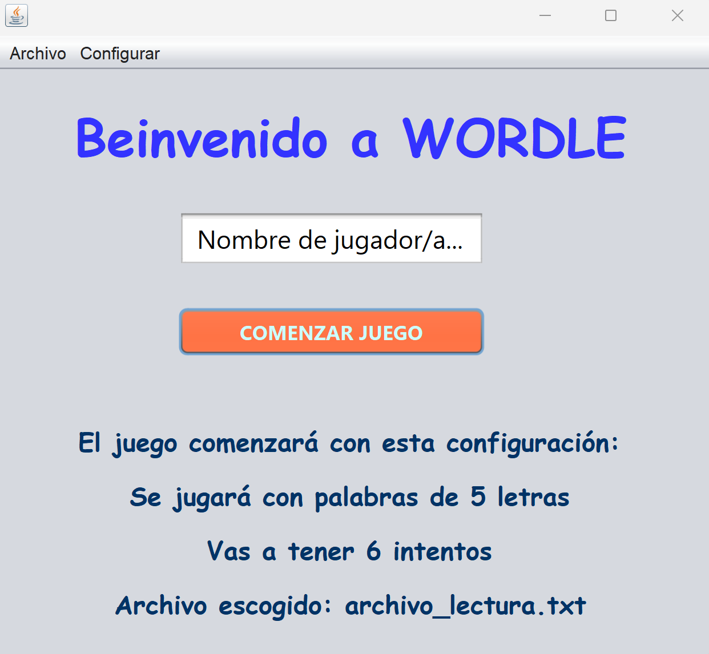

# 🎮 Wordle Java

**Wordle Java** es una versión de escritorio del popular juego Wordle, desarrollada en Java usando **Swing**.  
El jugador tiene un número limitado de intentos para adivinar una palabra secreta de longitud configurable, recibiendo pistas visuales por letra:

- ✅ Verde: letra correcta en la posición correcta  
- ⚠️ Amarillo: letra correcta en posición incorrecta  
- ❌ Rojo: letra no presente en la palabra  

---

## 🖼 Capturas de Pantalla

**Pantalla Principal**  
  

**Juego en acción**  
  

---

## 🛠 Tecnologías usadas

- Java 8+
- Swing para la interfaz gráfica
- NetBeans IDE (opcional, pero recomendado para abrir el proyecto)
